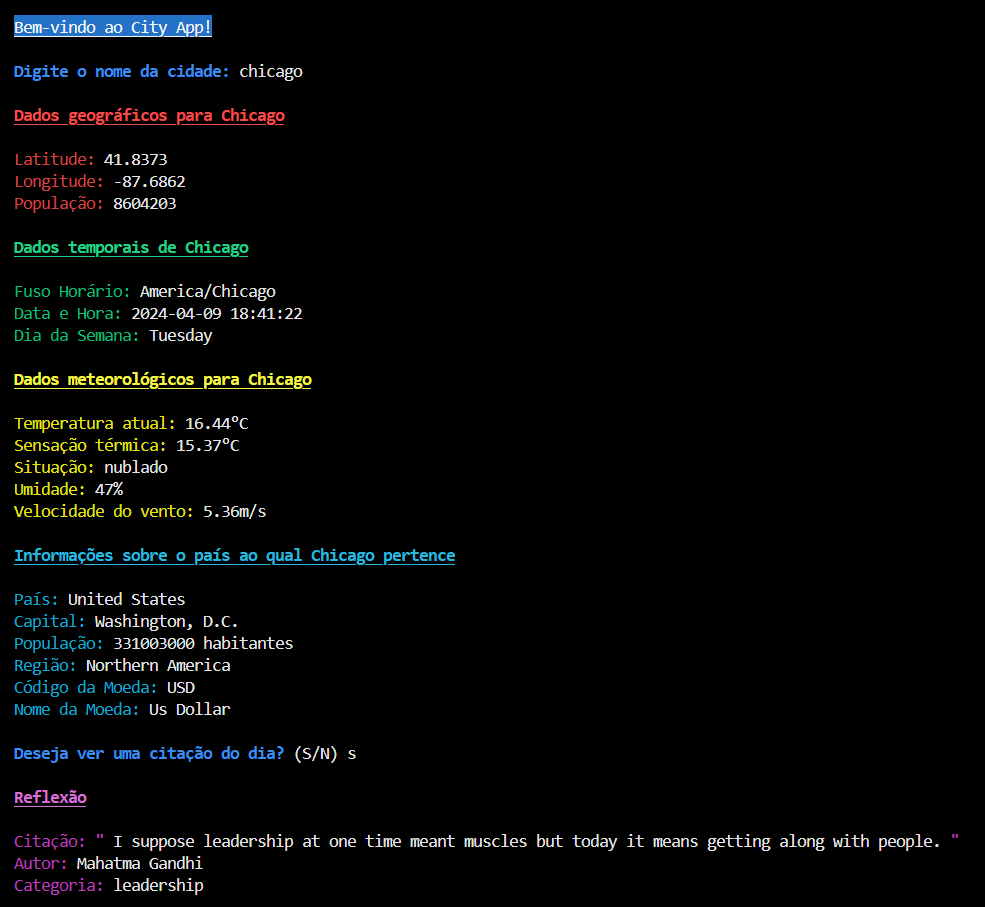

# Terminal City App

### Bem-vindo ao Terminal City App!

 Esta aplicação foi desenvolvida como parte de uma atividade que utiliza APIs de terceiros para fornecer informações sobre uma cidade específica.

## Sobre a Aplicação

O Terminal City App é uma aplicação para rodar no terminal, projetada para fornecer informações detalhadas sobre uma cidade específica, incluindo dados geográficos, informações meteorológicas, data e hora atuais, fuso horário e detalhes sobre o país ao qual a cidade pertence. Além disso, como um extra, a aplicação oferece a possibilidade de solicitar uma citação ou reflexão adicional, proporcionando uma experiência enriquecedora para o usuário.

## Funcionalidades Principais

- Solicitação do nome de uma cidade para recuperar informações detalhadas.
- Exibição de dados geográficos, meteorológicos, de fuso horário, data e hora atuais da cidade especificada.
- Fornecimento de informações sobre o país ao qual a cidade pertence.
- Opção adicional para visualizar uma citação ou reflexão randômica.

## Como Usar

#### Para começar a usar o Terminal City App, siga estas etapas simples:

1. **Certifique-se de ter o Node.js e o npm instalados.** *(Passo a Passo logo abaixo)*

2. **Clone este repositório:** *<span style="color: white;">git clone</span> https://github.com/rayner27k/Terminal-City-App.git

3. **Instale as dependências do projeto.** *(Passo a Passo logo abaixo)*

4. **Substitua as chaves das APIs pelas suas próprias chaves.** *(Passo a Passo logo abaixo)*

### <ins>Configuração</ins>

Antes de iniciar a aplicação, certifique-se de ter configurado corretamente as seguintes dependências:

- *[Node.js](https://nodejs.org/) instalado (v20.11.1)*
  - Você pode baixar e instalar o Node.js a partir do [site oficial](https://nodejs.org/). Siga as instruções de instalação para a sua plataforma.
- *[Npm](https://www.npmjs.com/) instalado (10.2.4)*
  - O npm é instalado automaticamente junto com o Node.js. Verifique se o npm está instalado executando o comando `npm -v` no seu terminal.

## Dependências

### <ins>Bibliotecas</ins>

Esta aplicação depende das seguintes bibliotecas:

- *[node-fetch](https://www.npmjs.com/package/node-fetch) (v2.2.7.0)* **-** Uma biblioteca para fazer requisições HTTP no Node.js.
- *[dotenv](https://www.npmjs.com/package/dotenv) (16.4.5)* **-** Carrega variáveis de ambiente de um arquivo `.env` para `process.env`.
 *<span style="color: white;">(Caso venha a precisar)</span>*

Caso venha a compartilhar o código em outro ambiente, você pode instalar todas as dependências necessárias executando o seguinte comando:

- **npm install node-fetch@2 dotenv**

Caso queira apenas clonar o código e testar na sua máquina, você pode instalar apenas o necessário executando o seguinte comando:

- **npm install node-fetch@2**

## Configurando Chaves de API

Para usar este aplicativo, você precisará configurar suas chaves de API para a OpenWeather e a API Ninjas. Você pode fazer isso de diferentes modos, seguindo estas etapas:

#### <ins>**Modo 1: Diretamente no código**</ins>

<span style="color: white;">Se seu intuito for apenas testar o código, siga as seguintes etapas:</span>

1. **Crie uma conta nos sites [API Ninjas](https://api-ninjas.com/) e [Openweather API](https://openweathermap.org/), e obtenha as suas chaves.**

    - Ao adquirir suas chaves, copie suas chaves de API e salve-as em um local seguro.

2. **Abra o arquivo apiFunctions.js e remova ou comente as seguintes linhas no topo do arquivo:**

    > const path = require('path');  
    > require('dotenv').config({ path: path.join(__dirname, 'keys.env') });

3. **Substitua as variáveis openWeatherApiKey e ninjasApiKey com suas próprias chaves de API:**

    > const openWeatherApiKey = 'SuaChaveOpenWeatherAqui';  
    > const ninjasApiKey = 'SuaChaveNinjasAqui';

4. **Certifique-se de substituir 'SuaChaveOpenWeatherAqui' e 'SuaChaveNinjasAqui' pelas suas próprias chaves de API.**

5. **Salve as alterações no arquivo.**

#### <ins>**Modo 2: Usando um arquivo *.env* e a biblioteca *dotenv***</ins>

<span style="color: white;">Se seu intuito for compartilhar o código em outros locais seguros, siga as seguintes etapas:</span>

1. **Crie uma conta nos sites [API Ninjas](https://api-ninjas.com/) e [Openweather API](https://openweathermap.org/), e obtenha as suas chaves.**

    - Ao adquirir suas chaves, copie suas chaves de API e salve-as em um local seguro.

2. **Com a biblioteca *<span style="color: white;">dotenv*</span> instalada no projeto, crie um arquivo `.env` no seu projeto.**

3. **Adicione suas chaves de API ao arquivo `.env` que você acabou de criar.**

   Por exemplo:
   ```plaintext
   OpenWeatherAK=SuaChaveAqui
   NinjasAK=SuaChaveAqui
- Substitua SuaChaveAqui pelas suas chaves de API reais.
- Certifique-se de que o arquivo .env esteja incluído no .gitignore para evitar o envio de suas chaves de API caso venha a usar o controle de versão.
- Carregue suas chaves de API no seu aplicativo usando o dotenv.

4. **No arquivo apiFunctions.js, vá até a seguinte linha no início do seu arquivo:**

    ``require('dotenv').config({ path: path.join(__dirname, 'SeuArquivo.env') });``

- Substitua SeuArquivo.env pelo nome do arquivo .env que você acabou de criar e colocou suas chaves nele.
- Isso carregará as variáveis de ambiente do arquivo .env.

5. **Use as chaves de API no seu aplicativo.**

    Por exemplo:
    ```plaintext
    const openWeatherApiKey = process.env.OpenWeatherAK;  
    const ninjasApiKey = process.env.NinjasAK;
- Certifique-se de substituir OpenWeatherAK e NinjasAK pelos nomes reais das variáveis de ambiente que você definiu no arquivo .env. 

6. **Salve as alterações no arquivo.**

&nbsp;

**Agora você está pronto para usar suas chaves de API no seu aplicativo!**  
***Observação:** Caso vá usar esse código para algo mais profissional ou de forma aberta, busque a forma mais segura de usar as suas chaves.*

## Uso

Após a instalação, você pode iniciar a aplicação usando os seguintes comandos:

- **npm start**
- **node app.js** *(Caso o caminho no terminal esteja dentro do diretório "src")*

## Exemplo do Terminal City App Funcionando



## <span style="color: white;">*Divirta-se*</span>

<span style="color: white;">Siga as instruções no terminal para fornecer o nome de uma cidade e explorar suas informações.</span>  
<span style="color: white;">Divirta-se explorando o </span><ins>[**Terminal City App**](https://github.com/rayner27k/Terminal-City-App.git)</ins><span style="color: white;"> e descobrindo dados interessantes sobre várias cidades ao redor do mundo!</span>
